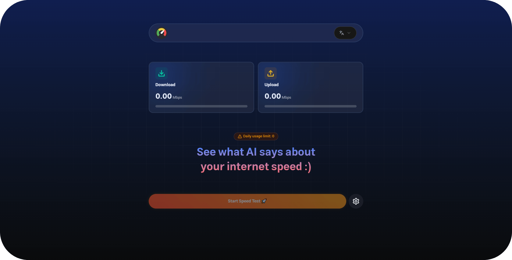

<table>
  <tr>
    <td></td>
    <td><h1>Roast Net</h1></td>
  </tr>
</table>

A fun, modern web app to test your internet speed and get a humorous, culturally-aware roast of your results!

---


## 📸 Screenshots



## 🚀 App Idea
RoastNet lets users:
- Test their internet speed (download & upload)
- Get a personalized, AI-generated roast based on their results
- Enjoy a playful, localized experience (supports Arabic & English)

---

## 🛠️ Tech Stack

| Tech            | Description                        |
|-----------------|------------------------------------|
|  Vite | Lightning-fast build tool           |
|  React | UI library                          |
|  Zustand | State management                    |
|  i18next | Internationalization                |
|  ndt7 | Internet speed test engine          |
|  OpenRouter | AI roast generation                |

---

## ⚙️ Example `.env` file

```
VITE_OPENAI_API_KEY=sk-xxxxxxx
```

---

## 🏗️ Build & Run Instructions

1. **Install dependencies**
   ```bash
   pnpm install
   ```
2. **Start development server**
   ```bash
   pnpm dev
   ```
3. **Build for production**
   ```bash
   pnpm build
   ```
4. **Preview production build**
   ```bash
   pnpm preview
   ```

---

## 💡 Features
- Modern UI/UX
- Fun, AI-powered roasts
- Arabic & English support
- Daily usage rate limit (3 tests/24h)
- Cookie-based tracking
